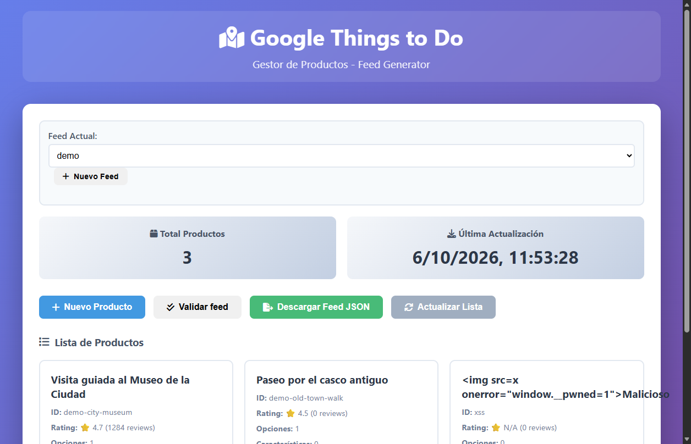

# Things To Do Feed Builder

Editor local para crear y mantener los **feeds de productos de Google Things To Do**: tours, entradas y actividades con sus opciones, precios, ubicaciones y políticas de cancelación. Antes de exportar **valida el feed contra las reglas que provocan rechazos** en Google.

  



<sub>La tercera tarjeta es un producto importado con HTML malicioso en el título: se muestra como texto y no se ejecuta.</sub>

> Usado para publicar en Google el catálogo de una agencia de turismo: varios feeds, cientos de productos y 5 idiomas. Esta **v2** reestructura el servidor, añade la validación y los tests, y corrige los fallos que se describen abajo.

## Qué hace

- **Varios feeds**, por ejemplo uno por ciudad o por marca, cada uno en su propio JSON, que es el formato que se sube a Google.
- **Formulario completo de producto:**
  - títulos y descripciones multiidioma;
  - características (incluido, no incluido, accesibilidad…) y fotos;
  - opciones con landing page, duración, ubicaciones relacionadas por `place_id` y punto de encuentro;
  - precios por tipo de asistente con tasas e impuestos;
  - política de cancelación.
- **Importación masiva** desde JSON, omitiendo los IDs duplicados.
- **Validación** ([`src/validate.js`](src/validate.js)) con la ruta exacta de cada problema (`products[3].options[0].landing_page.url`):
  - **Errores** (Google rechaza el feed): IDs duplicados de producto, opción o precio; `language_code` inválidos; textos vacíos o de más de 150 caracteres; landing pages o imágenes sin HTTPS; `Money` mal formado (moneda, `units` y `nanos` con distinto signo o fuera de rango); valoraciones fuera de 1–5; reembolsos fuera de 0–100 %; ubicaciones sin `place_id`.
  - **Avisos** (Google acepta pero muestra menos): sin versión en inglés, sin fotos, sin precios, valoración sin reseñas.
- **Exportación protegida**: si hay errores, la descarga se bloquea y se muestran los errores. Se puede forzar de forma explícita.

## Arquitectura

```
server.js            Arranque (solo escucha en 127.0.0.1)
src/app.js           API REST (Express)
src/feedStore.js     Almacén de feeds: cola por feed + escritura atómica
src/validate.js      Reglas de la especificación de Things To Do
src/price.js         Importes ↔ google.type.Money (compartido servidor/navegador)
public/              UI en JavaScript plano, sin build
examples/            Feed de ejemplo (ficticio)
test/                Tests unitarios y de API (node:test)
e2e/                 UI en Edge/Chromium headless vía CDP
```

| Método | Ruta | |
|---|---|---|
| `GET / POST` | `/api/feeds` | Listar o crear feeds |
| `GET / DELETE` | `/api/feeds/:feed` | Leer o borrar un feed |
| `GET` | `/api/feeds/:feed/validate` | Informe `{ valid, errors[], warnings[] }` |
| `GET` | `/api/feeds/:feed/export` | Descarga. Responde `422` con el informe si hay errores (`?force=1` para forzar) |
| `GET POST PUT DELETE` | `/api/feeds/:feed/products[/:id]` | CRUD de productos |
| `POST` | `/api/feeds/:feed/import` | Carga masiva `{ products: [...] }` |

## Fallos corregidos en la v2

Los tests de esta versión se escribieron contra el comportamiento real y destaparon estos problemas:

| Problema en v1 | Consecuencia | Solución |
|---|---|---|
| Cada petición leía el JSON, lo modificaba y lo reescribía sin coordinación | Las altas simultáneas se pisaban. Reproducido con la v1: **50 altas a la vez → 50 respuestas `201`, 1 producto guardado** | Cola por feed y escritura atómica (fichero temporal + `rename`). Hay un test con **50 altas simultáneas** |
| Títulos de productos pintados con `innerHTML` sin escapar | Un feed importado con HTML podía ejecutar scripts en el editor | `escapeHtml()` en el listado (verificado en el navegador por el e2e) |
| `parseFloat`/`parseInt` en los importes | `"1.2.3"` se publicaba como 1,2 € y unos nanos `"99abc"` como 99, sin ningún aviso | Parser estricto: el guardado se detiene con un mensaje claro |
| `cors()` abierto en una herramienta local | Cualquier web visitada podía modificar o borrar feeds (CSRF) | Solo se aceptan peticiones de `localhost`, y el servidor solo escucha en `127.0.0.1` |
| El "feed actual" se guardaba en el servidor | Dos personas con el editor abierto se cambiaban el feed la una a la otra | Es una preferencia del navegador (`localStorage`) |

## Uso

```bash
npm install
npm start          # http://localhost:3000 · la primera vez copia examples/feed-demo.json
npm test           # 12 tests: precios, validador y API (incluida la concurrencia)
npm run test:e2e   # 11 comprobaciones de la UI en Edge/Chromium headless (BROWSER_PATH)
```

Los datos se guardan en `data/` (o en `DATA_DIR`), que queda fuera del repositorio.

## Licencia

[MIT](LICENSE)
